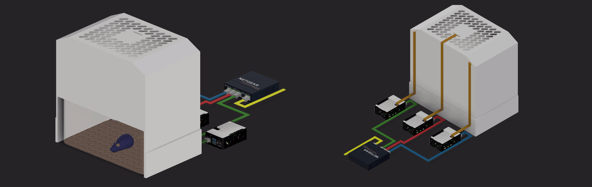
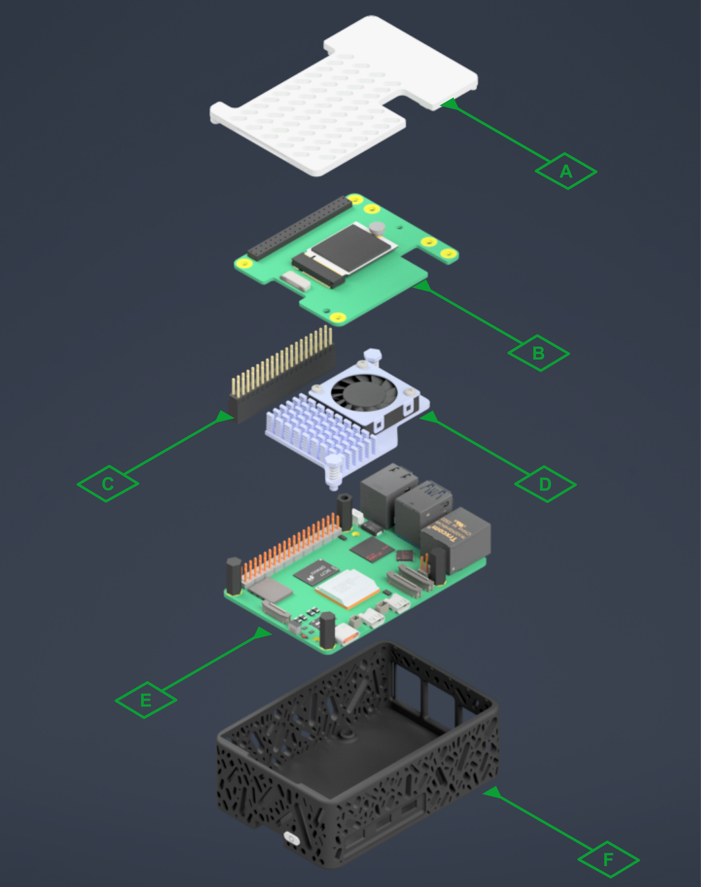
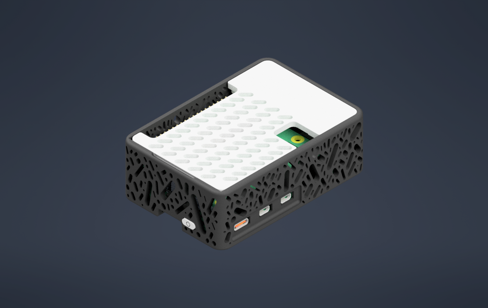

# Hardware Build Guide

How to build the physical SqueakShot recording rig: a custom three-camera,
calibrated and synchronized enclosure that seats a single mouse home cage and
films it from three synchronized overhead cameras. This document covers the
bill of materials, dimensions, 3D-printed parts, assembly, and wiring. For the
software install and day-to-day operation, see [INSTALL.md](INSTALL.md) and
[QUICKSTART.md](QUICKSTART.md).

  

The 3D-printed housing seats a single home cage (mouse shown on bedding at
left) while three overhead cameras look down into the arena. Each camera's
Raspberry Pi, in its own printed case, connects by Ethernet to a network
switch. The right-hand view shows the camera routing to the top of the housing.

## Bill of materials

The reference build uses three cameras (one server + two clients). Quantities
scale by the number of cameras.

### Compute and acquisition

| Qty | Item |
|:---:|------|
| 3 | Raspberry Pi 5 (8 GB) |
| 3 | Raspberry Pi 5 Official Active Cooler |
| 3 | Raspberry Pi 5 power supply |
| 3 | Raspberry Pi M.2 HAT+ |
| 3 | Raspberry Pi NVMe SSD (256 GB) |

### Cameras and optics

| Qty | Item |
|:---:|------|
| 3 | Raspberry Pi Camera Module 3 Wide NoIR (Sony IMX708, wide FOV; IR-cut filter omitted for recording under dim red light) |
| 3 | Official CSI FPC flexible cable, 22-pin to 15-pin, 500 mm (Raspberry Pi 5 compatible) |

### Networking and synchronization

| Qty | Item |
|:---:|------|
| 1 | Network switch (5-port Gigabit unmanaged Ethernet) |
| 3 | Ethernet cables |
| 3 | Real-time clock (RTC) module (one per Raspberry Pi, for hardware timekeeping) |

### Enclosure and fabrication

| Qty | Item |
|:---:|------|
| 1 | Bambu Lab X1-Carbon 3D printer |
| — | Black and white PLA filament |
| 1 | 860-pc M2–M5 12.9 alloy-steel hex bolt & nut kit (with lock and flat washers + wrench) |
| — | Superglue |
| — | White lab tape |

### Peripherals

| Qty | Item |
|:---:|------|
| 1 | Monitor |
| 1 | Raspberry Pi micro-HDMI to HDMI cable |

## Dimensions

The housing is purpose-built around one specific cage (Allentown PC75JHT), so
the cameras hold a fixed, calibrated geometry relative to the arena floor.

| Component | Depth | Width | Height |
|-----------|-------|-------|--------|
| 3D-printed recording housing | 200 mm | 210 mm | 306.5 mm |
| Allentown PC75JHT mouse cage | 186 mm (7.5 in) | 298 mm (11.75 in) | 128 mm (5 in) |

Cage floor area: 75 sq in (484 cm²).

## 3D-printed parts

All parts print in PLA on the Bambu Lab X1-Carbon. Print-ready `.3mf` files and
the editable Fusion 360 `.f3d` sources are in [`hardware/`](hardware/) — see
[`hardware/README.md`](hardware/README.md) for the full file index.

> **Note:** the `.f3d` / `.3mf` files are stored with [Git LFS](https://git-lfs.com).
> After cloning, run `git lfs pull` to download them (or download individually
> from the GitHub file browser).

### Recording housing

Five printed parts make up the enclosure that holds the cameras over the cage:
`LeftSide`, `RightSide`, `LeftStand`, `RightStand`, and `Lid_Housing`
(`hardware/print/recording_housing_parts/`).

> **Note:** add print settings (filament colors, layer height, supports, and
> approximate print time).

### Raspberry Pi case

Each Pi is built into its own printed case. The exploded view labels the
3D-printed parts (A, F) and the Raspberry Pi parts (B–E):

  
  &nbsp;&nbsp;
  

| Label | Part |
|:-----:|------|
| A | 3D-printed lid |
| B | M.2 HAT+ with NVMe SSD |
| C | Stacking GPIO header |
| D | Active Cooler |
| E | Raspberry Pi 5 |
| F | 3D-printed case body |

Printed parts: `Case_Supports`, `Lid`, `Buttons`
(`hardware/print/raspi_case/`).

## Assembly

1. **Print the parts.** Print the recording-housing parts and one Pi case per
   camera in PLA (files in [`hardware/print/`](hardware/print)).
2. **Build each Pi case.** Seat the Raspberry Pi 5 (E) in the case body (F).
   Add the Active Cooler (D) and a stacking GPIO header (C), then the M.2 HAT+
   carrying the NVMe SSD (B). Close with the vented lid (A).
3. **Mount cameras and Pis in the housing.** Fix each Camera Module 3 Wide NoIR
   at its overhead position and route its 500 mm CSI cable to its Pi. Use
   hardware from the M2–M5 kit; superglue where noted.
4. **Seat the cage.** Place the Allentown PC75JHT cage into the housing so the
   floor sits at the calibrated working distance.

> **Note:** add camera angle / mounting detail, which fasteners vs. superglue
> are used where, and any alignment marks for repeatable cage placement.

## Wiring & network

All three Raspberry Pi units connect by Ethernet to the network switch, forming
an isolated local network for footage transfer and clock synchronization. Each
Pi carries its own RTC module for hardware timekeeping between NTP syncs, and
each camera connects to its Pi over the 22-pin-to-15-pin CSI ribbon cable.

| Link | From | To |
|------|------|----|
| Data / sync | Each Raspberry Pi (×3) | Network switch (Ethernet) |
| Camera | Camera Module 3 Wide NoIR (×3) | Its Raspberry Pi (CSI, 500 mm) |
| Timekeeping | RTC module (×3) | Its Raspberry Pi (GPIO / I²C) |
| Power | Official Pi 5 supply (×3) | Its Raspberry Pi |

Keep the Pis on NTP / chrony so their wall clocks agree to within ~100 ms; the
controller's pre-flight check enforces this. See
[How synchronization works](README.md#how-synchronization-works) for detail.

## Next: software

With the rig assembled and networked, install and run the controller:

- [INSTALL.md](INSTALL.md) — full software installation walkthrough
- [QUICKSTART.md](QUICKSTART.md) — day-to-day recording and post-processing
